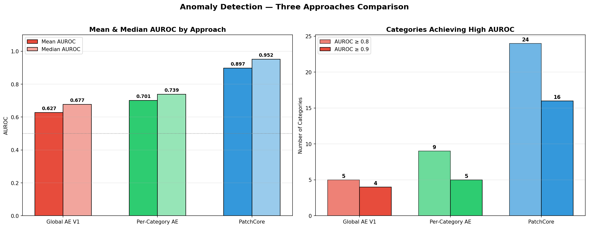
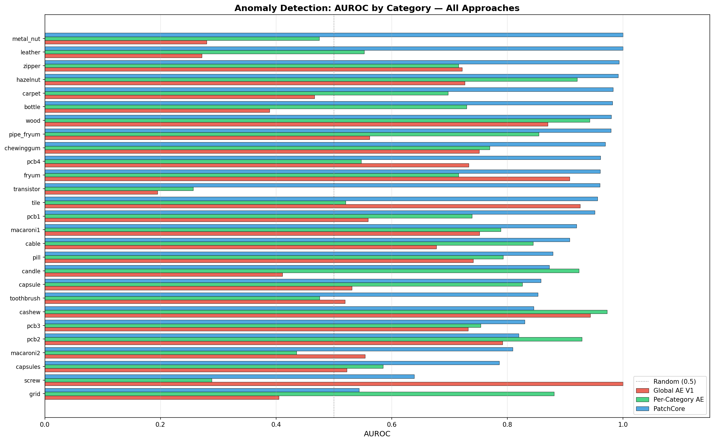
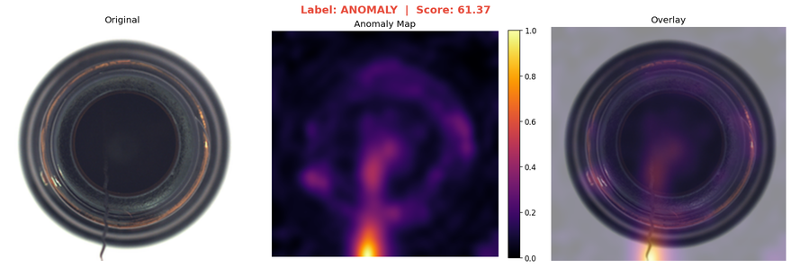

# Anomaly Detection on Industrial Images

Unsupervised anomaly detection pipeline comparing **reconstruction-based** models (Autoencoder, GAN, Diffusion) with a **feature-based** approach (PatchCore), trained and evaluated on 27 product categories from the **MVTec AD** and **VisA** benchmarks.

---

## Table of Contents

1. [Problem Statement](#problem-statement)
2. [Dataset](#dataset)
3. [Architecture](#architecture)
4. [Results Preview](#results-preview)
5. [Installation](#installation)
6. [Quick Start](#quick-start)
7. [Project Structure](#project-structure)
8. [Documentation](#documentation)
9. [License](#license)

---

## Problem Statement

Manufacturing quality control relies on visual inspection to detect defective products. Manual inspection is slow, error-prone, and does not scale. This project implements **unsupervised anomaly detection**: models learn what "normal" looks like from defect-free images only, then flag anything that deviates from that learned representation.

Two paradigms are compared:

- **Reconstruction-based** — Autoencoder, GAN, and Diffusion models learn to reconstruct normal images. Anomalies produce higher reconstruction error.
- **Feature-based** — PatchCore uses pre-trained ImageNet features and nearest-neighbor distance. No model training required.

---

## Dataset

The `combined_dataset/` directory is built by manually merging two public benchmarks into a unified folder structure. The images are **not included in the repository** — you must download each dataset from its original source and organize them following the layout below.

### Sources

| Benchmark | Categories | Source |
|---|---|---|
| **MVTec AD** | 15 (bottle, cable, capsule, carpet, grid, hazelnut, leather, metal_nut, pill, screw, tile, toothbrush, transistor, wood, zipper) | [mvtec.com](https://www.mvtec.com/company/research/datasets/mvtec-ad) |
| **VisA** | 12 (candle, capsules, cashew, chewinggum, fryum, macaroni1, macaroni2, pcb1, pcb2, pcb3, pcb4, pipe_fryum) | [github.com/amazon-science/spot-diff](https://github.com/amazon-science/spot-diff) |

### Combined Statistics

| Split | Count |
|---|---|
| Train / Good | 12,050 |
| Test / Good | 1,667 |
| Test / Anomaly | 1,501 |
| **Total** | **15,218** |

### Directory Layout

After downloading both datasets, organize them into this structure at the project root:

```
combined_dataset/
├── bottle/                    # MVTec AD category
│   ├── train/
│   │   └── good/              # defect-free images only
│   └── test/
│       ├── good/              # defect-free test images
│       └── anomaly/           # defective test images
├── candle/                    # VisA category
│   ├── train/good/
│   └── test/{good,anomaly}/
├── ...                        # 25 more categories
└── zipper/
    ├── train/good/
    └── test/{good,anomaly}/
```

All images are RGB. During training, every image is resized to **256 × 256** and normalized to `[0, 1]`.

---

## Architecture

Five approaches across two paradigms:

| Model | Params | Approach | Training Signal | Details |
|---|---|---|---|---|
| **Autoencoder V1** | ~4.4M | Reconstruction (3:1 compression) | MSE | [README](src/models/autoencoder/README.md) |
| **Autoencoder V2** | ~2.4M | Reconstruction (24:1 compression) | MSE + SSIM | [README](src/models/autoencoder/README.md) |
| **GAN** | ~7.2M (G+D) | Adversarial reconstruction | BCE + MSE | [README](src/models/gan/README.md) |
| **Diffusion (DDPM)** | ~2.7M | Denoising (ε-prediction) | MSE | [README](src/models/diffusion/README.md) |
| **PatchCore** | 68.9M (frozen) | Feature-based (k-NN) | No training | [README](src/models/patchcore/README.md) |

Each model README includes architecture diagrams, hyperparameters, design decisions, and references.

---

## Results Preview

### Global Performance Comparison

<p align="center">
  
</p>

> PatchCore (feature-based) achieves **AUROC = 0.834**, significantly outperforming all reconstruction-based approaches.

### Per-Category AUROC Breakdown

<p align="center">
  
</p>

### Anomaly Localization

PatchCore produces pixel-level anomaly heatmaps highlighting defective regions:

<p align="center">
  
</p>

For full results, analysis, and discussion, see [docs/RESULTS.md](docs/RESULTS.md).

---

## Installation

### Requirements

- Python ≥ 3.10
- PyTorch ≥ 2.0
- CUDA 12.x (recommended — GPU training is 5-10× faster)

### Setup

```bash
git clone <repo-url>
cd anomaly_detection_industrial_images

python -m venv .venv

# Windows
.venv\Scripts\activate
# Linux/macOS
# source .venv/bin/activate

# PyTorch with CUDA
pip install torch torchvision --index-url https://download.pytorch.org/whl/cu124

# Dependencies
pip install -r requirements.txt
```

### Dataset Preparation

Download [MVTec AD](https://www.mvtec.com/company/research/datasets/mvtec-ad) and [VisA](https://github.com/amazon-science/spot-diff) datasets, then organize them into the `combined_dataset/` structure described [above](#directory-layout). The pipeline auto-detects all categories present in this folder.

---

## Quick Start

```bash
# Train models
python -m src.models.autoencoder.train          # AE V1
python -m src.models.autoencoder.train_v2        # AE V2
python -m src.models.gan.train                   # GAN
python -m src.models.diffusion.train             # Diffusion
python -m src.models.patchcore.build_memory_bank # PatchCore

# Evaluate
python -m src.evaluate --model autoencoder
python -m src.evaluate_patchcore

# Compare all approaches
python -m src.compare_all_approaches

# Run tests
python -m pytest tests/ -v
```

See [docs/USAGE.md](docs/USAGE.md) for the full command reference including per-category training, anomaly localization, enhanced PatchCore, and configuration details.

---

## Project Structure

```
anomaly_detection_industrial_images/
├── src/
│   ├── config.py                     # Paths, hyperparameters, device config
│   ├── dataset.py                    # Dataset loading, validation, PyTorch datasets
│   ├── metrics.py                    # SSIM computation
│   ├── feature_extractor.py          # VGG-16 perceptual scoring
│   ├── evaluate.py                   # Unified model evaluation
│   ├── evaluate_per_category.py      # Per-category AE evaluation
│   ├── evaluate_patchcore.py         # PatchCore evaluation
│   ├── compare_models.py             # Cross-model comparison
│   ├── compare_all_approaches.py     # All approaches comparison
│   ├── localization.py               # Anomaly heatmap localization
│   └── models/
│       ├── autoencoder/              # AE V1, V2 & per-category
│       ├── gan/                      # Generator + PatchGAN Discriminator
│       ├── diffusion/                # DDPM U-Net
│       └── patchcore/                # Memory bank + enhanced features
├── tests/                            # Unit tests (53 tests)
├── docs/                             # Extended documentation
│   ├── USAGE.md                      # Full command reference (git-ignored)
│   └── RESULTS.md                    # Experimental results & analysis
├── requirements.txt
├── pyproject.toml
├── CHANGELOG.md
├── combined_dataset/                 # Images (git-ignored, see Dataset section)
├── outputs/                          # Trained weights & evaluations (git-ignored)
└── figures/                          # Comparison plots (git-ignored)
```

---

## Documentation

| Document | Description |
|---|---|
| [docs/USAGE.md](docs/USAGE.md) | Full pipeline details, all commands, configuration tables, evaluation metrics |
| [docs/RESULTS.md](docs/RESULTS.md) | Experimental results, performance tables, analysis & discussion, limitations |
| [src/models/autoencoder/README.md](src/models/autoencoder/README.md) | Autoencoder V1, V2 & per-category architecture and training |
| [src/models/gan/README.md](src/models/gan/README.md) | GAN architecture, adversarial training strategy |
| [src/models/diffusion/README.md](src/models/diffusion/README.md) | DDPM U-Net, noise schedules, inference strategy |
| [src/models/patchcore/README.md](src/models/patchcore/README.md) | PatchCore pipeline, memory banks, enhanced features |
| [CHANGELOG.md](CHANGELOG.md) | Version history |

---

## License

This project is for educational and research purposes. The MVTec AD and VisA datasets have their own respective licenses — please refer to the original sources for terms of use.
